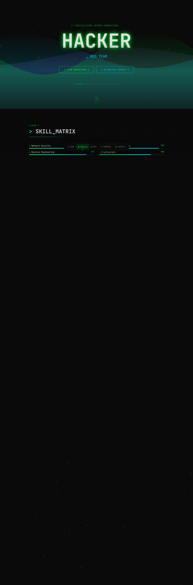

# 🟢 H4CK3R // CYBERSECURITY OPERATIONS

> A futuristic, hacker-themed cybersecurity portfolio website built with modern web technologies. Features terminal-style aesthetics, cyberpunk animations, and an immersive interactive experience.



---

## 🌐 Live Preview

```
http://localhost:5174
```

---

## ✨ Features

### 🎨 Visual Effects
- **CRT Scanline Overlay** — Retro monitor effect across the entire page
- **Glitch Text Animation** — Hacker-themed title with glitch effect (ReactBits)
- **Aurora Background** — Animated gradient aurora wave (ReactBits)
- **Particle System** — Floating data particles for depth (ReactBits)
- **Splash Cursor** — Interactive particle trail following mouse cursor (ReactBits)
- **Grid Scan Effect** — Matrix-style grid scanning animation (ReactBits)
- **Rotating Text Carousel** — Auto-rotating cybersecurity specializations
- **Scrambled Text** — Decryption-style text reveal animation (ReactBits)
- **Neon Glow Animations** — Pulsing glow on headings and interactive elements

### 🧭 Navigation
- **macOS-style Dock Navigation** — Floating bottom nav bar with spring physics animations (Framer Motion)
- **Intersection Observer** — Auto-detects active section and highlights it
- **Smooth Scroll** — Animated scrolling between sections
- **Hover Magnification** — Dock items scale up on hover

### 📄 Sections

| # | Section | ID | Description |
|---|---------|----|-------------|
| 0x01 | **HERO** | `#home` | Full-screen hero with glitch title, rotating specializations (CYBERSECURITY, PENETRATION TESTING, RED TEAM, EXPLOIT DEVELOPMENT, MALWARE ANALYSIS), CTA buttons, and fake terminal command |
| 0x02 | **SKILL_MATRIX** | `#skills` | 8 animated skill bars (Network Security 95%, Reverse Engineering 88%, Malware Analysis 85%, Exploit Development 90%, Web App Security 92%, Cryptography 80%, Social Engineering 75%, Cloud Security 82%) + certification badges (OSCP, CEH, CISSP, GPEN) |
| 0x03 | **OPERATIONS_LOG** | `#projects` | 6 project cards with severity ratings [CRITICAL/HIGH/MEDIUM], status badges (COMPLETED/ACTIVE/DISCLOSED), and tag system |
| 0x04 | **LIVE_TERMINAL** | `#terminal` | Simulated Kali Linux terminal with auto-typing animation: nmap scan → searchsploit → exploit → shell access |
| 0x05 | **ESTABLISH_CONTACT** | `#contact` | Contact cards with scrambled text animation for Email, GitHub, PGP Key + SHA256 fingerprint display |

---

## 🛠 Tech Stack

| Layer | Technology |
|-------|-----------|
| **Framework** | React 19 + TypeScript |
| **Build Tool** | Vite 8 |
| **Styling** | Tailwind CSS 4 (with custom @theme) |
| **Animations** | Framer Motion 12 |
| **Effects Library** | ReactBits (GlitchText, Aurora, Particles, SplaschCursor, RotatingText, ScrambledText, GridScan, TextType, AnimatedList) |
| **Font** | JetBrains Mono / Fira Code / Cascadia Code |

---

## 🎨 Design System

### Color Palette
```css
--color-hacker-green:   #00ff41  /* Matrix green */
--color-hacker-cyan:    #00d4ff  /* Terminal cyan */
--color-hacker-red:     #ff0040  /* Error/alert */
--color-hacker-purple:  #8b5cf6  /* Accent purple */
--color-hacker-dark:    #0a0a0a  /* Primary background */
--color-hacker-darker:  #050505  /* Darker surfaces */
--color-hacker-surface: #111111  /* Card/panel background */
--color-hacker-border:  #1a1a2e  /* Border color */
```

### Typography
- **Primary Font:** JetBrains Mono, Fira Code, Cascadia Code (monospace)
- **All text uses monospace fonts** to maintain terminal aesthetic

### Custom Animations
- `glow-pulse` — Pulsing neon glow on main heading
- `border-glow` — Glowing border animation for interactive elements
- Custom scrollbar styled with neon green/cyan colors

---

## 📁 Project Structure

```
hacker-site/
├── public/
│   ├── favicon.svg
│   ├── icons.svg
│   └── screenshot.png              ← Screenshot for README
├── src/
│   ├── assets/
│   │   └── hero.png
│   ├── components/
│   │   ├── reactbits/              ← Effect components
│   │   │   ├── AnimatedList.tsx
│   │   │   ├── Aurora.tsx
│   │   │   ├── GlitchText.tsx
│   │   │   ├── GridScan.tsx
│   │   │   ├── Particles.tsx
│   │   │   ├── RotatingText.tsx
│   │   │   ├── ScrambledText.tsx
│   │   │   ├── SplashCursor.tsx
│   │   │   └── TextType.tsx
│   │   └── sections/               ← Page sections
│   │       ├── ContactSection.tsx
│   │       ├── DockNav.tsx
│   │       ├── HeroSection.tsx
│   │       ├── ProjectsSection.tsx
│   │       ├── SkillsSection.tsx
│   │       └── TerminalSection.tsx
│   ├── App.tsx
│   ├── App.css
│   ├── index.css                   ← Global styles + theme
│   └── main.tsx
├── index.html
├── package.json
├── tsconfig.json
├── tsconfig.app.json
├── tsconfig.node.json
├── vite.config.ts
└── eslint.config.js
```

---

## 🚀 Getting Started

### Prerequisites
- Node.js >= 18
- npm / yarn / pnpm

### Installation

```bash
# Clone the repository
git clone https://github.com/mrhacker51/hackersite.git
cd hackersite

# Install dependencies
npm install

# Start development server
npm run dev
```

The site will be available at `http://localhost:5174`

### Available Scripts

| Command | Description |
|---------|-------------|
| `npm run dev` | Start development server with HMR |
| `npm run build` | Type check + production build |
| `npm run preview` | Preview production build locally |
| `npm run lint` | Run ESLint checks |

---

## 📦 Dependencies

### Production
- `react` ^19.2.4
- `react-dom` ^19.2.4
- `framer-motion` ^12.38.0

### Development
- `typescript` ~6.0.2
- `vite` ^8.0.4
- `tailwindcss` ^4.2.2
- `eslint` ^9.39.4
- `@types/react` ^19.2.14
- `@types/react-dom` ^19.2.3

---

## 🔧 Configuration

### Tailwind CSS Custom Theme
Custom theme defined in `src/index.css` using `@theme` directive:
- Custom color variables (hacker-green, hacker-cyan, etc.)
- Custom font stack (JetBrains Mono → Fira Code → Cascadia Code)

### Vite Config
Standard React + TypeScript setup with HMR.

---

## 📸 Screenshots

### Hero Section
```
┌─────────────────────────────────────────────┐
│  // INITIALIZING SECURE CONNECTION...       │
│                                             │
│         ╔═══════════════════╗               │
│         ║   H A C K E R     ║  ← Glitch FX  │
│         ╚═══════════════════╝               │
│                                             │
│  > EXPLOIT DEVELOPMENT  ← Rotating text     │
│                                             │
│  [ VIEW OPERATIONS ]   [ ESTABLISH CONTACT ]│
│                                             │
│  root@kali:~$ nmap -sV --script=vuln target │
└─────────────────────────────────────────────┘
```

---

## 🎯 Customization

### Change Hero Title
Edit `src/components/sections/HeroSection.tsx`:
```tsx
<GlitchText text="YOUR_TITLE" speed={4000} />
```

### Change Rotating Specializations
```tsx
texts={['YOUR TEXT 1', 'YOUR TEXT 2', 'YOUR TEXT 3']}
```

### Change Skills
Edit `src/components/sections/SkillsSection.tsx`:
```ts
const skills = [
  { name: 'Your Skill', level: 90, icon: '🎯' },
  // ...
]
```

### Change Colors
Edit `src/index.css` → `@theme` section to modify all colors.

### Change Projects
Edit `src/components/sections/ProjectsSection.tsx` → `projects` array.

---

## 📝 License

MIT — Free to use, modify, and distribute.

---

## 👤 Author

**mrhacker51**
- GitHub: [@mrhacker51](https://github.com/mrhacker51)
- Portfolio: https://mrhacker51.github.io/hackersite

---

<div align="center">

**H4CK3R** // _Securing the digital frontier, one exploit at a time._

</div>
